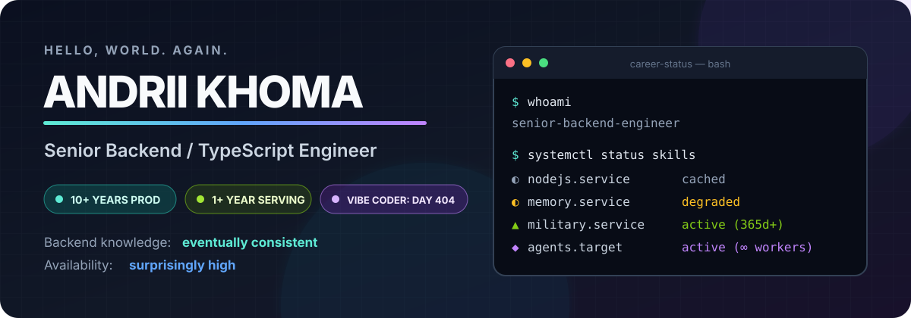
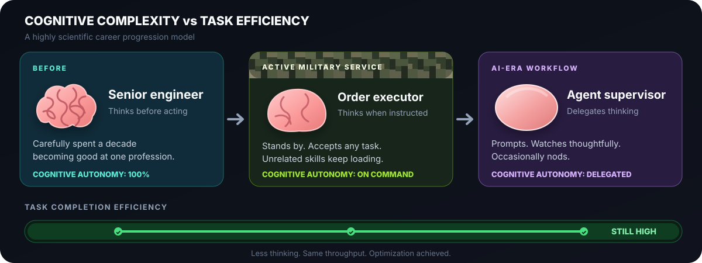

  

I spent **10+ years** becoming a backend specialist. I am now a year into ongoing military service, where I rarely get to code and my civilian stack is slowly migrating from RAM to cold storage. Fortunately, AI arrived and confidently gave me five new professions.

Currently serving in the **Armed Forces of Ukraine** — an environment with no staging, rapidly changing requirements, and unusually strict uptime expectations.

> **One year and counting in the army:** my backend knowledge is now *eventually consistent*, but still surprisingly highly available.

  

> Less independent thinking. Same task throughput. This is what the industry calls **optimization**.

## What I actually know without autocomplete

- Designing backend systems from initial research and architecture to production
- TypeScript and Node.js, including migrations, AST tooling, code generation, and type-safe APIs
- Distributed and event-driven systems with queues, Pub/Sub, WebSockets, and real-time workloads
- AWS serverless architecture: Lambda, API Gateway, SQS, SNS, Step Functions, Cognito, and CDK
- PostgreSQL, MongoDB, Redis, production reliability, payments, and the occasional race condition at 3 AM

## Military skill tree — still unlocking

- Standing at attention with enterprise-grade posture
- Thinking on command; speculative execution is disabled
- Executing orders exactly as requested, including undocumented requirements and surprise scope changes
- Accepting absolutely any task from any domain with `acceptAnyTask: true`
- Continuously learning new skills carefully selected to have nothing to do with programming

## My AI-era workflow

- Delegate everything to agents: code, research, moving folders, opening browser windows, and occasionally thinking
- Spawn another agent whenever a task begins to resemble manual work
- Watch the agents with a thoughtful, deeply technical expression
- Occasionally nod to satisfy the human-in-the-loop requirement
- Review the final diff and take full responsibility for whatever the agents felt creative about

**Human contribution:** supervision face. **Manual work:** deprecated. **Agent count:** eventually scalable.

## What the agents say I am qualified for now

- UAV ground control, MAVLink, ArduPilot, navigation, and things with propellers
- ESP32, embedded systems, electronics, and confidently staring at a multimeter
- RF/SDR, GNU Radio, USRP, signal processing, and antennas that may or may not be pointed correctly
- Python and C++ — with adequate supervision from the compiler
- Pen plotters, G-code, font geometry, and other perfectly normal backend concerns

**Confidence:** generated. **Curiosity:** real. **Production experience:** unfortunately also real.

## Civilian tech stack

  

`TypeSpec` · `Prisma` · `Elasticsearch` · `RabbitMQ` · `WebSockets` · `React` · `Angular`

## Current side quests

  

`ArduPilot` · `MAVLink` · `ESP32` · `RF/SDR` · `GNU Radio` · `AI-assisted development`

> `Works on my machine.`  
> The machine now has propellers.

## Contact

[LinkedIn](https://www.linkedin.com/in/aslipyi/) · [Email](mailto:anikkhoma@gmail.com)
